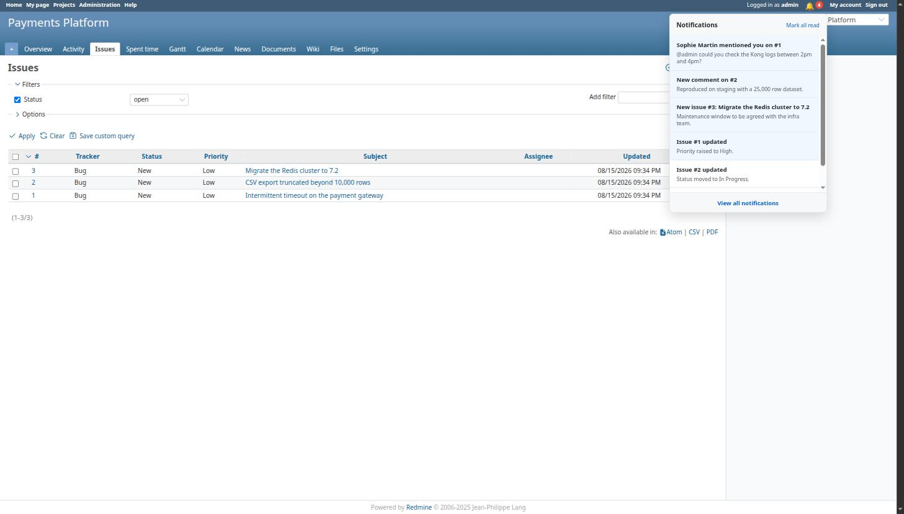
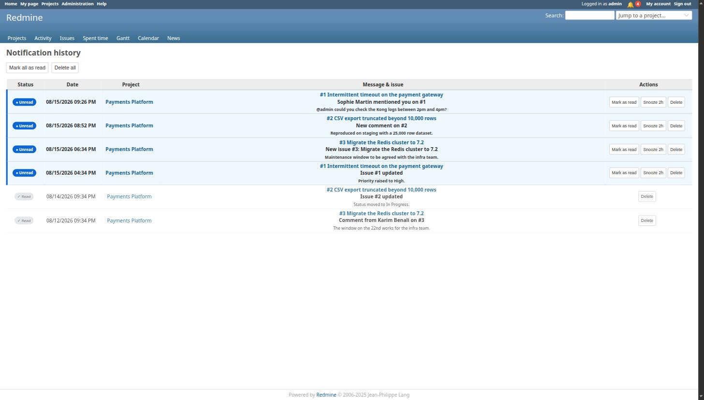
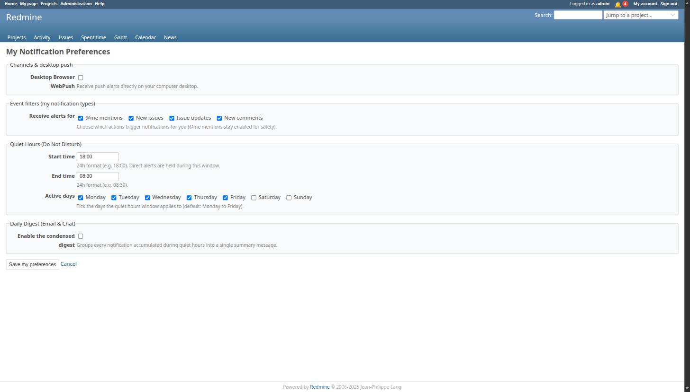
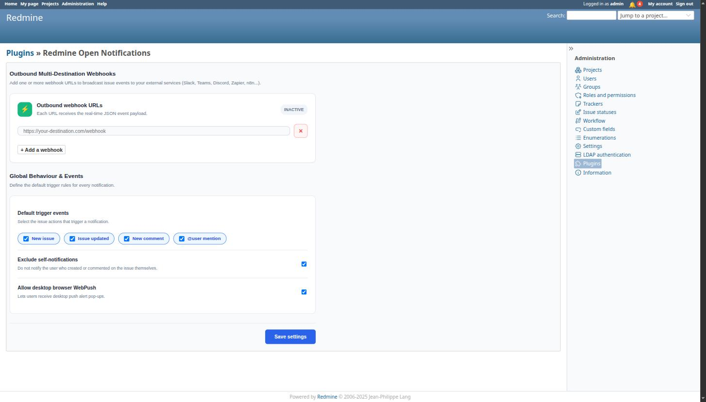

# Redmine Open Notifications

[](https://github.com/ziakor/redmine_open_notifications/actions/workflows/ci-release.yml)
[](https://github.com/ziakor/redmine_open_notifications/releases)
[](LICENSE)

Real-time browser notifications, foreground desktop alerts, `@mentions`, and outbound JSON webhooks for Redmine 5.x and 6.x.

## Table of Contents

- [Screenshots](#screenshots)
- [Features](#features)
- [Compatibility](#compatibility)
- [Installation](#installation)
- [Configuration](#configuration)
  - [Administrator Settings](#administrator-settings)
  - [User Preferences](#user-preferences)
- [Automated Digest](#automated-digest)
- [Running Tests](#running-tests)
- [License](#license)

## Screenshots

**Notification bell**: unread badge and dropdown in the account menu.



**Notification history**: read, unread and snoozed, with per-row actions.



**User preferences**: event filters, quiet hours, active days, digest.



**Administration settings**: outbound webhooks and global trigger rules.



## Features

- **In-App Navigation Icon**: Live unread badge count and interactive notification dropdown menu in the top navigation bar.
- **Desktop Browser Notifications**: Native OS notification pop-ups triggered while a Redmine tab is open (foreground only — this is not background Push API delivery).
- **Smart `@user` Mentions**: Automatic login detection in issue descriptions and comment notes.
- **Multi-Destination Outbound Webhooks**: Broadcast real-time JSON payloads to external HTTP webhook endpoints (Zapier, n8n, custom webhooks, or integration gateways).
- **Quiet Hours & Work Days**: Per-user do-not-disturb schedules with customizable active work days (Monday to Friday).
- **Structured Daily Digest**: Offline notification rollup into a single daily summary card with direct comment anchor links (`#note-X`).
- **Granular Event Filters**: Per-user preferences to toggle alerts for mentions, issue creation, updates, and comments.
- **Translatable**: All strings go through Rails i18n (English and French shipped).

## Compatibility

- Redmine 5.0.x, 5.1.x, 6.0.x
- Ruby 3.0, 3.1, 3.2, 3.3
- Rails 6.1.x, 7.0.x, 7.2.x
- PostgreSQL, MySQL, SQLite3

## Installation

Clone this repository into your Redmine `plugins/` directory:

```bash
cd /path/to/redmine/plugins
git clone https://github.com/ziakor/redmine_open_notifications.git redmine_open_notifications
```

Run plugin database migrations:

```bash
bundle exec rake redmine:plugins:migrate RAILS_ENV=production
```

Restart your Redmine application server:

```bash
docker restart redmine_container
```

## Configuration

### Administrator Settings

Navigate to **Administration > Plugins > Redmine Open Notifications > Configure**:

- **Outbound Webhook URLs**: Add one or multiple destination endpoints.
- **Default Triggers**: Select global trigger actions (issue creation, updates, comments, mentions).
- **Self-Notification Exclusion**: Suppress alerts for actions performed by the active user.

### User Preferences

Users can manage personal notification preferences via **My Account > Notifications** (`/notification_preference`):

- Toggle desktop browser notifications (foreground only, while a Redmine tab is open).
- Enable or disable specific event types (Mentions, New Issues, Updates, Comments).
- Configure quiet hours and active work days.
- Toggle daily digest summaries.

## Automated Digest

To run the daily digest job for users during quiet hours, schedule the following runner task via `cron` (e.g. daily at 08:00 AM):

```bash
bundle exec rails runner "NotificationDigestJob.perform_now" RAILS_ENV=production
```

## Running Tests

Run the test suite locally:

```bash
ruby -Iapp/services -Iapp/models -Itest test/unit/mention_parser_test.rb
ruby -Iapp/models -Itest test/unit/user_notification_preference_test.rb
ruby -Iapp/services -Itest test/unit/webhook_delivery_service_test.rb
```

## License

Created by Dimitri Hauet. Released under the [MIT License](LICENSE).
